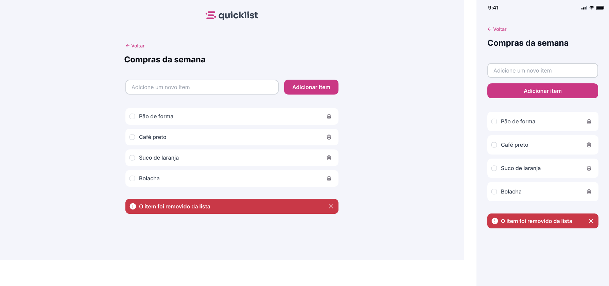

# 🛒 QuickList

O **QuickList** é uma aplicação web simples e responsiva para **criação e gerenciamento de listas de compras**, permitindo adicionar, marcar e remover itens de forma rápida e intuitiva.

O foco do projeto é praticar **HTML, CSS e JavaScript**, com ênfase em **manipulação do DOM**, **feedback visual ao usuário** e **organização de código front-end**.

---

## ✨ Funcionalidades

- ➕ Adicionar novos itens à lista  
- ✅ Marcar itens como concluídos  
- 🗑️ Remover itens individualmente  
- ⚠️ Exibir feedback visual ao remover um item  
- 📱 Layout totalmente responsivo (desktop e mobile)  
- 🎨 Interface limpa, moderna e acessível  

---

## 🖼️ Preview do Projeto

---
